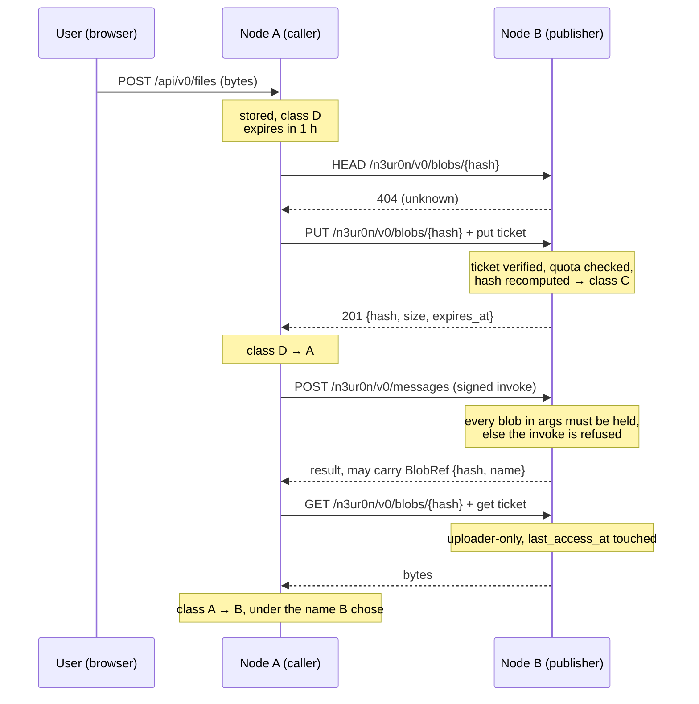

# The life of a file between two nodes

*Status: reference, written 2026-09-13 against the code at commit `7ac92f9`. English by request; the rest of the doc set is French.*

This describes what actually happens to a file when one n3ur0n instance sends it
to another, from the moment a user picks it to the moment a garbage collector
removes it. It is a companion to [n3ur0n-blob-protocol-v0.md](n3ur0n-blob-protocol-v0.md),
which specifies the wire format; this one follows a single file through the
runtime and names the file and line where each step happens.

Two instances appear throughout: **A**, the *caller*, which holds the file and
wants a capability run on it, and **B**, the *publisher*, which exposes the
capability. Nothing about the roles is fixed — an instance is a caller for one
exchange and a publisher for the next.

---

## 1. Premises, checked against the code

The starting premises for this document were: *once a file is in a node's
store, that node serves it only over HTTP, and every access is logged.* One
holds, one does not.

**Served only over HTTP — true, across two distinct surfaces.** Bytes leave a
node through exactly two routes, and nothing else reads the store on behalf of
a remote party:

| Surface | Route | Who may call it | Authentication |
|---|---|---|---|
| Wire | `PUT/GET/HEAD/DELETE /n3ur0n/v0/blobs/{*hash}` | Any peer on the network | A signed, single-use `blob_ticket` in `X-N3UR0N-Ticket` |
| Local | `GET/POST/DELETE /api/v0/files`, `GET /api/v0/files/{*hash}` | The operator's own browser or CLI | Session cookie + RBAC permission (`files:read`, `files:delete`) |

There is no peer-to-peer byte channel outside HTTP, no streaming, and no
replication: a blob exists at its publisher, and nowhere else unless someone
downloads it ([spec §13](n3ur0n-blob-protocol-v0.md)).

**Every access is logged — false today.** This is worth stating plainly because
the rest of the design reads as though it were true. `crates/server/src/blobs.rs`,
which serves the entire wire surface, contains **no logging statement of any
kind**. The only trace an access leaves is `blobs.last_access_at`, a single
column overwritten on each successful `GET` ([blobs.rs:357](crates/server/src/blobs.rs#L357)
calling [`blobs::touch`](crates/storage/src/blobs.rs#L328)). That records *that*
somebody read the file at some point. It does not record who, how many times,
or what happened before the last time.

Nothing at all is recorded for:

- a `GET` refused because the caller is not the uploader,
- a ticket that failed verification, expired, or was replayed,
- a `PUT` rejected for quota, size mismatch, or hash mismatch,
- a `HEAD`, which needs no ticket at all (see §4.3),
- a `DELETE`, successful or refused.

Section 8 says what closing that gap would take. Until then, treat "all accesses
are logged" as an objective, not a description.

---

## 2. The five states a file passes through

The store is content-addressed: the primary key is the `sha256:` hash, and the
bytes live at `<config>/blobs/sha256/<hash>`. Every other property —
who sent it, what it is for, what it is called — hangs off that one row.

A blob's **class** (A–D, [spec §2.4](n3ur0n-blob-protocol-v0.md)) is derived
from three columns:

| Class | `provenance` | `role` | `anchor_kind` | Meaning |
|---|---|---|---|---|
| **D** — local cache | `outbound` | `input` | `local_cache` | Staged on A, not yet referenced on the network |
| **A** — outbound | `outbound` | `input` | `user_session` | A uploaded it to a peer for an invoke A started |
| **C** — cap staging | `inbound` | `input` | `cap_job` | B received it so one of B's capabilities can run |
| **B** — inbound output | `inbound` | `output` | `user_session` | A received it as the result of a remote invoke |

Class C is infrastructure and never appears in the user Files panel, not even
for an Admin; it is listed only at `GET /api/v0/cap-jobs/blobs`.

**One row per hash, and therefore one class and one name at a time.** This is
the consequence most likely to surprise: on node A, a file that is sent and then
returned is not two records. It is one record that moves D → A → B. Two
simultaneous names for identical bytes are not representable.

---

## 3. Stage by stage



### 3.1 The file enters A's store — class D

`POST /api/v0/files` with the bytes as the body, the MIME type in
`Content-Type` and the filename percent-encoded in `X-N3UR0N-Path`
([files_api.rs:56](crates/server/src/files_api.rs#L56)). The header is
percent-encoded because header values are latin-1; the server decodes and
sanitizes it.

[`store_local_cache`](crates/node/src/blob_resolve.rs#L300) hashes the bytes,
writes them to `<config>/blobs/sha256/<hash>`, and indexes the row as class D
with a **one-hour** TTL (`BlobPurpose::Input`).

Two behaviours are worth knowing here:

- **The hash is the identity, the name is a label.** Re-uploading identical
  bytes under a different filename keeps the first name:
  `path = COALESCE(blobs.path, excluded.path)` in
  [`upsert`](crates/storage/src/blobs.rs#L120). The response reports the stored
  name, not the submitted one.
- **An upload always lands in class D**, whatever the Files panel is showing.
  That is why the Outbound and Inbound sections offer no Upload button: a file
  cannot be put there by hand.

### 3.2 A forges a ticket and uploads — class C on B

Nothing is uploaded eagerly. The transfer happens when a plan step is about to
invoke a remote capability whose arguments mention a blob:
[`prepare_invoke_args`](crates/node/src/blob_resolve.rs#L196) walks the argument
tree, collects every `BlobRef`, and for each one:

1. reads the bytes back from the local store, failing with a clear message if
   they are gone;
2. `HEAD`s the peer — if B already holds the blob, the upload is skipped
   entirely (this is why any test of the transfer must use unique bytes);
3. forges a `blob_ticket` envelope: a normal signed N3UR0N envelope whose verb
   is `blob_ticket`, carrying operation, hash, size, MIME and the target
   capability, base64url-encoded into `X-N3UR0N-Ticket`;
4. `PUT`s the bytes;
5. promotes the local row from class D to class A
   ([`mark_outbound`](crates/storage/src/blobs.rs#L159)).

B verifies the ticket in [`verify_ticket`](crates/server/src/blobs.rs#L51) —
the checks are cumulative and all must pass:

| Check | Failure |
|---|---|
| Envelope signature, `hash(pk) == sender_id`, recipient is us, timestamp within ±5 min | 401 |
| Verb is `blob_ticket` | 400 |
| Nonce unseen — the ticket is **single-use** | 409 `ticket replay` |
| Operation matches the HTTP method | 400 |
| `expires_at` not passed | 401 `ticket expired` |
| Ticket hash matches the path hash | 400 |

Then, for a `PUT` specifically ([put_blob](crates/server/src/blobs.rs#L204)):
the ticket must name a capability, a size and a MIME type; the capability must
exist and not be `Private`; the per-peer quota must hold (**100 MB and 50 blobs**
per uploader, counting unexpired rows); the body length must equal the declared
size; and **the hash is recomputed from the received bytes** and must equal the
path hash. Only then are the bytes written and indexed as class C, with
`uploader_id` set to the ticket's signer.

A `PUT` of bytes B already holds and has not expired returns `200` without
rewriting anything — the operation is idempotent.

### 3.3 The capability runs

A sends a normal signed `invoke` to `/n3ur0n/v0/messages`. Before dispatching,
B checks that it actually holds every blob the arguments mention
([handler.rs](crates/node/src/handler.rs)); if not, the invoke is refused with a
message naming the hash, rather than reaching a capability that cannot do its
job.

What a capability can *do* with a blob is where the current runtime stops short.
The argument carries `{hash, size, mime}` — a reference, not the bytes — and
`Backend::invoke(capability, args)` receives only that JSON, with no handle on
the store. All three binding kinds (`prompt`, `http`, `mcp`) address a remote
executor, so passing an on-disk path would not help either: an LLM endpoint and
a remote HTTP API cannot read B's filesystem, and only an MCP server on the
`stdio` transport shares it.

The capability that exists today, `rename_file` in the `utility` backend, is
deliberately the one that needs none of this: renaming is metadata, so it
returns the same hash with a `name` field set. It exercises the whole
round trip without touching a byte. Delivering bytes to a capability, and
ingesting a blob a capability produces, are both unbuilt.

### 3.4 The result comes back — class B on A

[`fetch_output_blobs`](crates/node/src/blob_resolve.rs#L239) walks the result for
`BlobRef`s. For each one, if the bytes are not local it forges a `get` ticket,
downloads, **re-hashes and compares** before writing, then records the row as
class B with a **24-hour** TTL (`BlobPurpose::Output`).

If the bytes *are* already local — which is exactly what a rename produces —
the download is skipped but the bookkeeping is not: the row still moves to class
B and takes the name the capability chose
([`mark_inbound_output`](crates/storage/src/blobs.rs#L159)). A `name` on the
incoming ref is sanitized before it is stored; it is a label chosen by a remote
peer, never a path to trust. Without one, A assigns a provisional name derived
from the capability and a timestamp.

### 3.5 Expiry

TTLs are set at insert time by purpose: **1 h** for inputs (classes A, C, D),
**24 h** for outputs (class B). A `put` ticket may ask for longer through
`requested_ttl_secs`; the publisher grants up to **7 days** and otherwise
ignores the request silently, reporting what it actually granted in the `201`
response.

The ticket's own `expires_at` has nothing to do with this: it is a five-minute
authorization window. Conflating the two is a mistake with no visible symptom
at upload time — the transfer succeeds, the capability runs, and the file
quietly disappears on the next GC sweep. A blob past its `expires_at` is already
invisible — `GET` and `HEAD` return 404 on the timestamp alone, before any file
access. A background task sweeps every **10 minutes**
([blob_gc.rs](crates/server/src/blob_gc.rs)), deleting expired rows and their
files, and logs a count when it removes anything.

`DELETE` over the wire is restricted to the original uploader
([blobs.rs:390](crates/server/src/blobs.rs#L390)); a local RBAC account, however
privileged, can never obtain a delete ticket for a class C blob. Locally, the
operator can delete their own class A, B and D blobs through
`DELETE /api/v0/files/{hash}`.

---

## 4. Who may do what

### 4.1 Upload

Any peer whose ticket verifies, for any capability that is not `Private`,
within the per-peer quota. There is no allowlist of senders: the network is open
by default, and the quota is the only structural defence against a peer filling
the disk.

### 4.2 Download

[`get_authorization`](crates/server/src/blobs.rs#L306) grants a `GET` to the
blob's `uploader_id`, or to any instance id present in the blob's
`recipients_whitelist`. **The whitelist is never populated today**: the client
sets `recipients_whitelist: None` when forging a put ticket
([blob_client.rs](crates/node/src/blob_client.rs)). In practice, therefore, a
blob can be downloaded only by the peer that uploaded it.

This matters for the unbuilt half of §3.3. When a capability starts producing
output blobs on B, the caller A will not be the uploader of those bytes, and the
present rule would refuse the download. Granting it will need either a populated
whitelist or a rule tying the output to the invoke that produced it.

### 4.3 Existence

`HEAD` requires **no ticket** ([blobs.rs:368](crates/server/src/blobs.rs#L368)).
Anyone who can guess or otherwise learn a hash can confirm that a given node
holds those bytes, and read back their size and MIME type. Since a hash is
knowable only to someone who already has the bytes (or saw the hash), the
disclosure is narrow — but it is a disclosure, it is unauthenticated, and it is
unlogged. It exists to make the idempotent-upload check cheap.

---

## 5. Failure modes, by status code

| Code | Cause |
|---|---|
| 400 | Malformed hash; wrong verb; operation mismatch; ticket hash ≠ path hash; missing capability/size/MIME on a put ticket; body size ≠ declared size; recomputed hash ≠ declared hash |
| 401 | Missing `X-N3UR0N-Ticket`; signature, binding, recipient or clock-window failure; expired ticket |
| 403 | Capability is `Private`; caller is neither uploader nor whitelisted; `DELETE` by someone other than the uploader |
| 404 | Unknown blob; expired blob; file missing from disk though the row survives |
| 409 | Ticket nonce already seen — replay |
| 429 | Per-peer quota exceeded (bytes or count) |
| 503 | Blob storage not configured on this instance |

---

## 6. What the receiver knows about a stored file

Per class C row, from [the PUT path](crates/server/src/blobs.rs#L165):
`hash`, `size`, `mime`, `storage_path`, `expires_at`, the `capability` the
upload was for, `uploader_id` and `remote_sender_id` (the peer's instance id),
the `ticket_nonce` that authorized it, and `created_at` / `last_access_at`.

It does **not** know a filename — `path` is `None` for class C. The name lives
on the sender's side and, if a capability chooses to return one, on the
`BlobRef` it produces.

---

## 7. Two properties that hold end to end

**Content integrity.** The hash is verified three times along the path: by B
when it receives the bytes, by A when it downloads a result, and implicitly by
`read_local_bytes`, which discards a local file whose contents no longer hash to
its name. Corrupted or substituted bytes cannot pass silently.

**Single use of authorization.** Every ticket carries a nonce checked against
the anti-replay table, so a captured ticket cannot be replayed — not even by the
peer that legitimately obtained it.

---

## 8. What "every access is logged" would require

The gap is narrow and the shape is clear. An access record needs, per attempt:
the timestamp, the operation, the hash, the requesting instance id, the ticket
nonce, the outcome (served / refused / not found) and, on refusal, the reason.
Three pieces are missing:

1. **A place to write it.** `last_access_at` is a single overwritten column. An
   audit trail is append-only and needs its own table — hash, actor, operation,
   outcome, timestamp — with its own retention policy, since it must outlive the
   blob it describes.
2. **Instrumentation on the refusal paths.** The success path knows who the
   caller is; a ticket that fails verification may not even identify a sender,
   and that case is precisely the one worth recording.
3. **A retention decision.** An access log about peers is personal data about
   the operators behind those peers. How long it is kept, and whether it travels
   anywhere, is a policy question this document cannot settle.

Adding `tracing` lines is the cheap half and would already give an operator
something to grep. It is not an audit trail: `tracing` output is unstructured by
default, subject to `RUST_LOG`, and lost when nobody collects it.

---

## 9. Known gaps

- **No access log** (§1, §8).
- **`HEAD` is unauthenticated** (§4.3).
- **A capability cannot read a blob's bytes** (§3.3) — the missing half of file
  processing, along with ingesting an output blob a capability produces.
- **The recipients whitelist is inert** (§4.2) — the field exists on the wire
  and is honoured by the server, but nothing sets it, so downloads are
  uploader-only.
- **One name per hash** (§2) — right for a rename, wrong for a capability that
  would copy a file under a second name.
- **Input TTL does not slide.** [Spec §5.1](n3ur0n-blob-protocol-v0.md) says an
  input blob lives for an hour *after last access*. A `GET` updates
  `last_access_at` but never extends `expires_at`, so the hour runs from upload
  and a file in active use can expire under a peer that is still reading it.
- **Quotas are compile-time constants**, not per-peer policy
  ([blobs.rs](crates/server/src/blobs.rs)).

---

## 10. Verifying this document

The cluster test walks the whole path against two live nodes:

```bash
docker compose -f docker/compose.yml up -d --build node-a node-b
cargo test -p n3ur0n-node --test cluster_blob_transfer -- --ignored --nocapture
```

It asserts the transfer, the class transitions on both sides, byte-identical
round-tripping through a signed `GET`, that class C never surfaces in the user
Files panel, that a rename comes back as class B under its new name, and that a
peer refuses a blob it was never sent.
